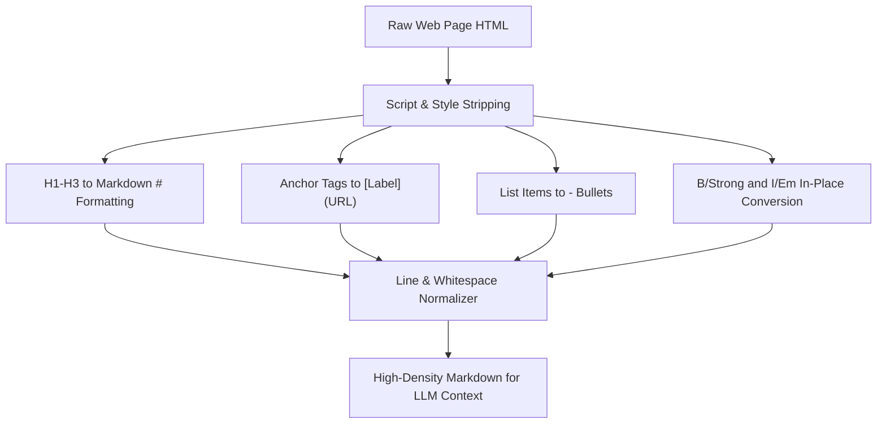

# genpark-html-to-markdown-semantic-converter-skill

Agent Skill implementing **Pure Python Semantic HTML-to-Markdown Conversion** in 100% Python standard library.

## Architectural Flow

```mermaid
flowchart TD
    Raw["Raw Web Page HTML"] --> Clean["Script & Style Stripping"]
    Clean --> Headings["H1-H3 to Markdown # Formatting"]
    Clean --> Links["Anchor Tags to [Label](URL)"]
    Clean --> Lists["List Items to - Bullets"]
    Clean --> Formatting["B/Strong and I/Em In-Place Conversion"]
    Headings & Links & Lists & Formatting --> Norm["Line & Whitespace Normalizer"]
    Norm --> CleanMD["High-Density Markdown for LLM Context"]
```
